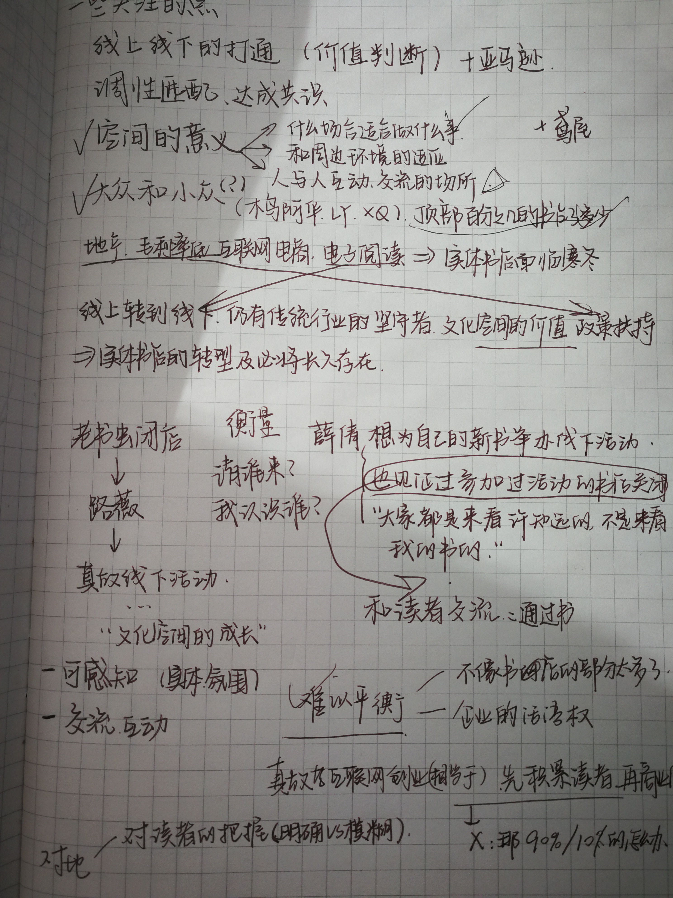
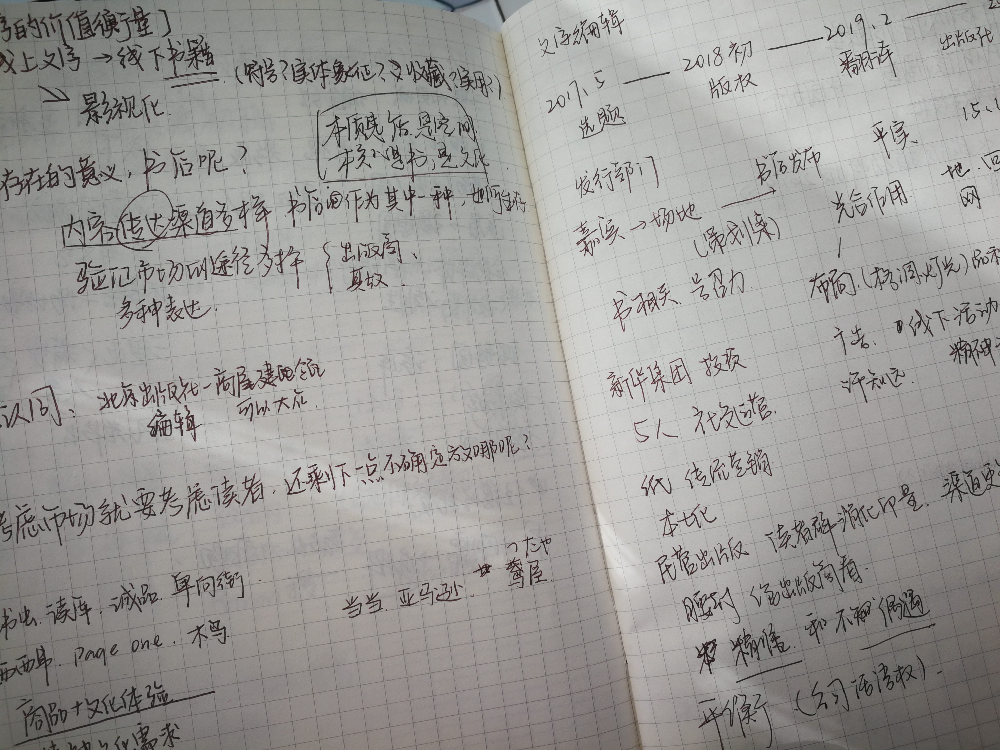
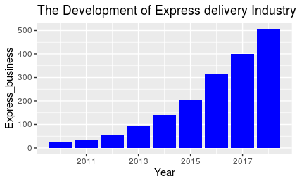
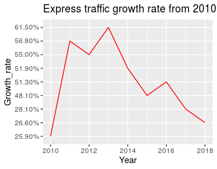
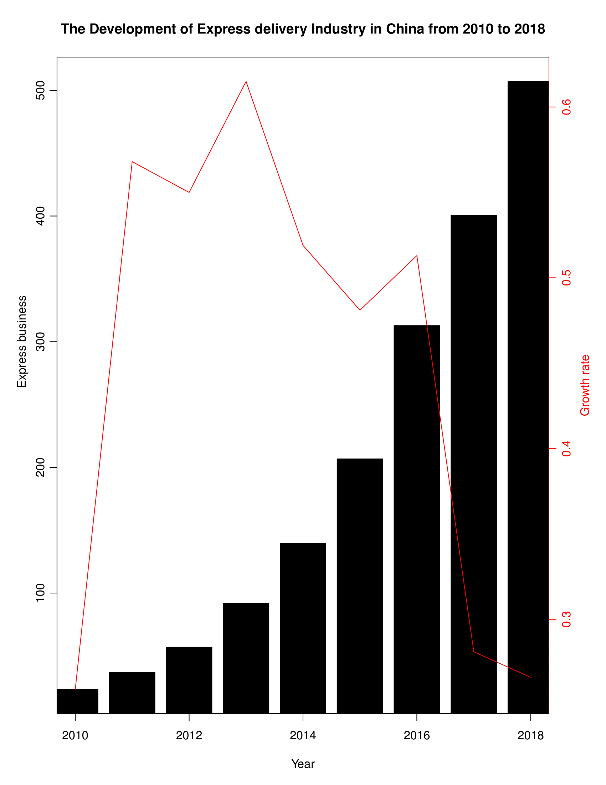
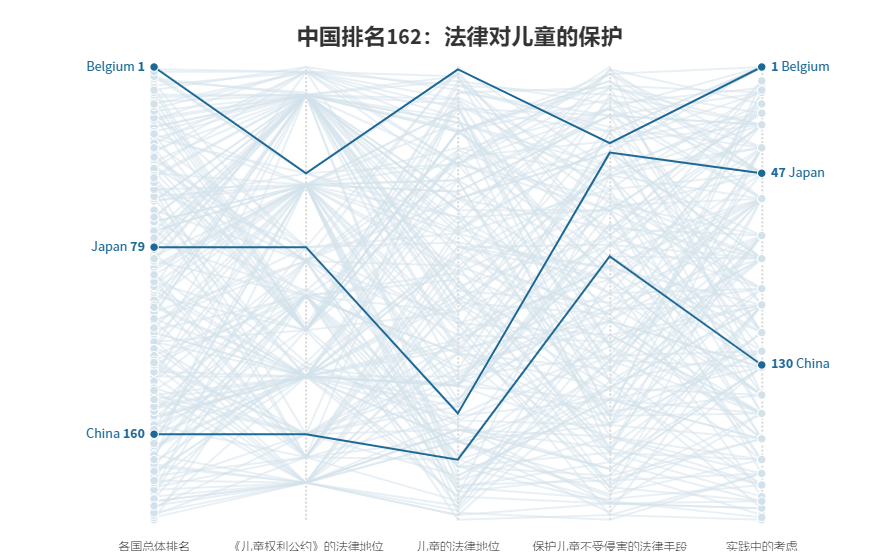
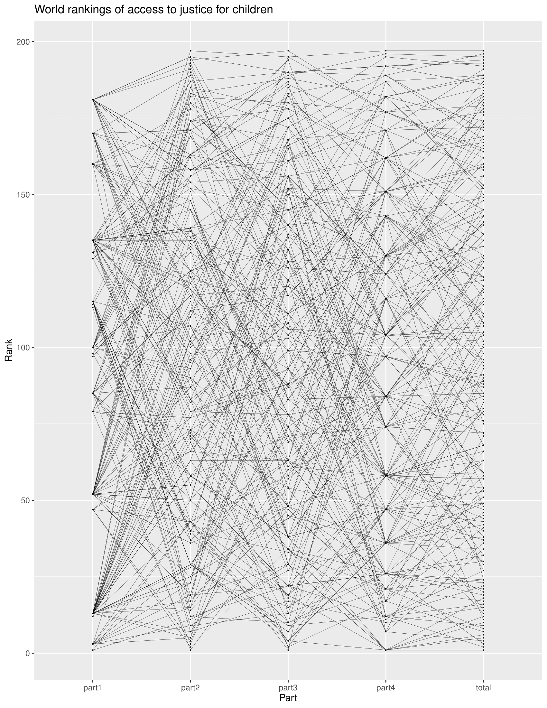
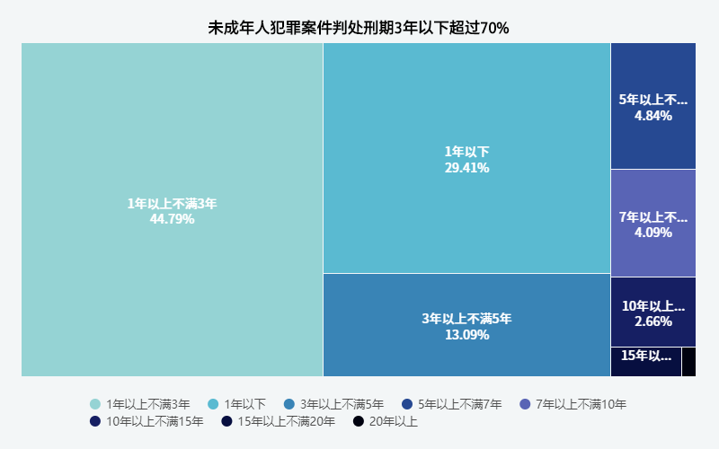

# 期末作业过程描述              
## 选题想法、资料搜集过程             
（1）选题想法来源于这学期在院刊《新闻视野》带的一个题，看到交上来的初稿里用了一些奇奇怪怪的数据，既没说清楚数据指什么，也没有和上下文结合，就觉得不行，然后在准备给他们指出问题之前找了一些资料，其中也发现了一些数据，算是对这个主题有了初步了解。当时觉得选择这个题能说的比较多，而且也算是有新闻热点，而且应该不会缺数据，所以就定了这个题。（但是要确定角度和内容，还蛮困难的。）              
（2）了解相关政策，包括国家整体和北京的。一个是北京的扶持力度确实越来越大，但是大部份钱都花在房地产上了，（个人担忧书店会不会成为一种附属，在采访时也得到了相关验证），还有就是发现政策倾向扶持连锁书店和大型书城等，更多关注社会效益，和周边社区的联系。因此也有一小部分定位小众的书店不在这一范围内（比如踩点时去的木鸟漫画），故不作主要论述。                
（3）最后确立的范围是关注实体书店中的民营书店（不包括大型书城，说是非新华书店也行。）因为我觉得在国内很少说“独立书店”这个词，而且和连锁相对的话就与我想描述的对象发生了排斥，而且独立书店可能更关注店主个人对书店的影响，参考[央视的一个纪录片《书迷》](https://www.bilibili.com/video/av22530917)，而我的文章基于书店活动策划和做书的人展开，角度不太一样。           
> 独立书店（independent bookstore）一词通常用于一间主要以当地人拥有、经营的书店。这种书店可以构建为独资企业、少数人持股公司或合作伙伴（即少数股东或合作伙伴）、合作社或非营利组织。这种书店可与当地社区有紧密的结合，并可经常和非营利社群活动接触，而且可帮助培养年轻作家。独立书店的书的选择往往较连锁书店的选书较为深奥或偏向非主流市场，所以独立书店有部分的书是创作者个人出版的书。独立书店可以是连锁书店的相反词。——维基百科                          

（4）一些关于探讨书店经营发展的报道和论文，了解了实体书店的分类和一些转型的方式（书店+，提供服务，营造氛围，举办活动，与地产开发商合作等），对分析有一定帮助。结合一些个案书店的报道（豆瓣、季风（……）、读易洞、老书虫等），总结书店经营货转型的困难。（比如北京，近年持续的专项整治就是很大的一个影响因素）           
（5）关于实体书店相关的报告。（源数据真的好难找_(:з」∠)_ ）                        
（6）看了《书店里的影像诗》、NHK书店72小时纪实等一些关于实体书店的纪录片。             
（7）向做过相关调研的同学简单了解了北京实体书店的经营情况和理念，还有顾客在书店的消费习惯以及一些看法。（总之去书店的人收入都挺高是真的）               
（8）采访对象：Page One活动策划、活字文化编辑、真故编辑。整理采访过程中的要点，标出关键句。把简化的零散的点理出来，比如关于xx的讨论一定要写；把采访中提到的一些内容进一步查资料补充。                                          
（9）写文章的时候随时查资料，后来发现页面打开很多不知道要找啥了（……），就把要找的问题先写在文档，然后查到相关内容，记录下来（+链接）。                       

## 确定内容框架的过程                                     
（1）搜集资料的时候，列出了一些可能可以可视化的维度，有想法了就往上加一点。                   
（2）按照国内/国外，经营/精神/政策等标签搜集资料，把关键信息标出，持续补充。          
（3）把上述整理的文档略看一遍，在一张白纸上把已有的想法进行整合（比如开头怎么开，哪一句话要放，关于一个主题的部分内容要写，怎么串联等），参考下图（**可能要加载久一些**）             
          
                    
（4）写作。写完再看n遍，批注需要修改的地方，修改。（自己改自己稿循环）不清楚的地方就把大意写出来，考虑和上下文是否贴合、怎么调顺序等。              

## 视觉呈现的选择                                  

（1）写作过程中把想象中的可视化插入其中，然后把原先对应的数据清理到excel里，进行筛选、计算等，把数据处理好。                   
（2）做的第一个图是那个地图，花的时间也最久，现在的作用是一个辅助说明，就是相对更直观一些。[单读以前做过一个北京书店地图](https://mp.weixin.qq.com/s/MYskzw_QwBmkX3eF_9cxrQ),其中标了已经关闭的书店（跟老师之前的建议类似），不过我没有统计，不然其实把某段时间内关掉的书店标灰加进去，冲击感会更强，主要也是没有统计出这个数据。**最复杂的部分是标记经纬度**，谷歌地图只用书店名不一定搜得到，所以过程是把书店名用国内地图搜索，再把详细地址名放入谷歌地图搜索，再复制经纬度（有一家书店只用名字还搜不到地方）。一开始我把经纬度取小数点两位，但是好像误差有点大（几百米吧），现在的位置是取了小数点后三位的（好像几十米误差也不小…）。有时间尝试老师推荐的方法。                  
（3）发现florish可以做类似ppt的功能，刚好有个书店复合业态的每个图都可以用一个形式，放在一起可以让读者感受更直观一点，而且还有交互作用，点击的时候就会更关注图的内容。不过有一个小问题，就是类别区分用的是百分比，但是显示比例用的也是百分比，可能乍一看会有点懵，不过源数据就是这样，我也没想出更好的办法，就是再图上标记数据的时候使用的是扇形本身的比例，然后占总营业额的比例用的图注。还有就是颜色，flourish自带的颜色都是彩色的，这个颜色是我自己调的（之前学的亮度、饱和度什么的，在调色的时候有了鲜明感受hhh）。                 
（4）动态折线图也是，因为最主要的信息是那个交错点，而且也很简洁看着，原来的模板是选举投票变化的，那个圆圈里的是选举人的头像，我换成了代表“实体书店”和“互联网”的标志hhh。                          
（5）最后那个散点图，emm其实我的数据维度没有那么多，像圆的大小和位置都表示一个信息，也是最主要的信息。颜色表示另一个信息（再次吐槽配色，两端极值好像不能选，有些方案的个别颜色就浅得几乎看不见了…）这个图跟其他的比起来我觉得一般吧。也是后来赶做的，算是补充信息。但是也能看出其实文化氛围很好的北京上海，没有大家想象得有和人一样多的书店，而北京市的目标也是很多其他城市早就超过的。但是毕竟也不能只看数量，没法过多解读。            

## 参考资料（链接或文件）                               

（1）[南方周末报道《北京老书虫书店：无尽的告别，无尽的相遇》](http://www.jingkan.net/getarticle/5dd357404da0f57ec3bf9ad5)                           
（2）[老书虫：Important Announcement / 重要通知](https://mp.weixin.qq.com/s/rH1qv3QXgVtUb6J6X5853A)                       
（3）[美国书商协会关于独立书店的报道](https://www.bookweb.org/for-the-record)                        
（4）[纽约时报发起的关于“书店如何保持活力”的讨论](https://www.nytimes.com/roomfordebate/2014/03/26/how-can-bookstores-stay-alive)                  
（5）[亚马逊开线下书店](https://www.geekwire.com/2015/its-official-amazon-is-opening-its-first-ever-bookstore-in-seattle/)                   
（6）[CCC公司官网对茑屋书店的介绍](https://www.ccc.co.jp/en/showcase/sc_004392.html?cat=life)                 
（7）[对茑屋书店报道1](http://blog.japantimes.co.jp/yen-for-living/rental-video-stores-ponder-their-reason-for-existing/)                   
（8）[对茑屋书店报道2](https://news.panasonic.com/global/stories/2018/62991.html)                               
（9）[虎嗅网-日本茑屋书店创始人增田宗昭谈实体零售：做亚马逊做不到的事](https://www.huxiu.com/article/201957.html)                        
（10）[揭秘中国收入规模最大的民营书店](https://www.huxiu.com/article/290453.html)                         

（11）[2018年国家及各省市实体书店最新政策汇总及解读](https://www.qianzhan.com/analyst/detail/220/180503-1d746aaf.html)                     
（12）[北京市人民政府办公厅印发《关于支持实体书店发展的实施意见》的通知](http://gdj.beijing.gov.cn/zwxx/tzgg/201807/t20180718_4774.html)                         
（13）[2019北京市实体书店资金扶持项目入围单位公示名单](http://www.bjdyj.gov.cn/noticeList1_showNoticeDetail.action?id=30987570DD13626963C0BA2E14D44138)                     
（14）[中宣部、国家新闻出版广电总局等11部门联合印发《关于支持实体书店发展的指导意见》](http://www.gov.cn/xinwen/2016-06/18/content_5083377.htm)                      
（15）[《北京市实体书店扶持资金管理办法》](http://gdj.beijing.gov.cn/zwxx/tzgg/201810/t20181016_5133.html)              
（16）[2019北京市书店评选](http://bj.people.com.cn/GB/n2/2019/1123/c82846-33569454.html)

## 用到的数据（链接或文件）                         
（1）[北京开卷信息技术有限公司《全球背景下的中国图书零售市场趋势》](https://mp.weixin.qq.com/s/p4pTsHlvkM7A0mEGdraYhA)             
（2）[北京开卷信息技术有限公司《2018图书零售市场报告》](http://www.sohu.com/a/287724414_211393)               
（3）[《2018-2019中国实体书店产业报告》](http://www.199it.com/archives/896288.html)                    
（4）[2018年中国图书产业发展现状及趋势分析](http://www.chyxx.com/industry/201910/791121.html)                         
（5）[国家统计局各主要城市人口数量（2018年）](http://data.stats.gov.cn/easyquery.htm?cn=E0103)                         
（6）[2019年北京市书店评选](http://www.bjdyj.gov.cn/noticeList1_showNoticeDetail.action?id=5E3D505FACED9FDD9C71A6DBABE13625)                        
（7）[中国各城市书店数量-中国书刊发行协会 百道网 前瞻产业研究院整理](https://www.qianzhan.com/analyst/detail/220/190320-463fd6cc.html)


# 第九周作业        

<details>
<summary>展开</summary>
 
## 图一
* 原图

* ggplot       
分别做成两张图

```r
> data <- read.csv("data1.csv")
> ggplot(data = data,aes(x = Year,y = Express_business))+
+ geom_bar(stat = "identity")
+ geom_bar(stat = "identity",fill = "blue")+
+ ggtitle("The Development of Express delivery Industry in China from 2010 to 2018")

ggplot(data = data,aes(x = Year,y = Growth_rate,group = 1))+
+ geom_line(stat = "identity",color = "red")+
+ labs(title = "Express traffic growth rate from 2010 to 2018")
```         

效果如下：      
     
        
做成一张图

```r
Year<- c(2010,2011,2012,2013,2014,2015,2016,2017,2018)
> Consumers <- c(23.4,36.7,56.9,91.9,139.6,206.7,312.8,400.6,507.1)
> Amount <- c(0.259,0.568,0.55,0.615,0.519,0.481,0.513,0.281,0.266)
> df1 <- data.frame(Date = Date, Consumers=Consumers, Amount = Amount)
> library(plotrix) 
twoord.plot(lx = df1$year, ly = df1$Express_business, rx = df1$Year, ry = df1$Growth_rate,main = 'The Development of Express delivery Industry in China from 2010 to 2018', xlab = 'Year', ylab = 'Express business', rylab = 'Growth rate', type = c('bar','line'))
```      

效果如下：      


## 图二
* 原图           
              
* ggplot                

```r
> data <- read.csv("law.csv")
> ggplot(data=data, aes(x=Part, y=Rank, group=Country)) +
+ geom_line(size = 0.1)+ 
+ geom_point(size = 0.05)+
+ ggtitle("World rankings of access to justice for children")
```            

效果如下：      
               

尝试将个别线条变色，但是以下代码没有显示出来…             

```r
+ scale_linetype_manual(values=c("China", "Japan","Belgium"))+
+ scale_size_manual(values=c(0.15, 0.15,0.15))+
+ scale_color_manual(values=c('#1d6996','#1d6996','#1d6996'))     
```
</details>     

# 第六周作业  

<details>
<summary>展开</summary>
    
## 未成年人保护法修法：谈刑罚时，别忘了保护的初衷     
保护与惩罚从来不是对立。     

大连女童遇害事件中，当人们为受害者打抱不平时，加害者因未达到法定刑事责任年龄14周岁，依法不予追究刑事责任，按照法定程序报经上级公安机关批准，已于10月24日依法对其收容教养。

10月26日，十三届全国人大常委会第十四次会议举行分组会议，审议《未成年人保护法（修订草案）》、《预防未成年人犯罪法（修订草案）》等。据新华社报道，预防未成年人犯罪法修订草案实施分级预防、细化教育矫治措施。

要对未成年人犯罪实施分级预防，教惩相辅的手段，最大的难点在于平衡保护与惩罚的尺度，这一平衡不仅体现在当事人双方的考虑上，也体现在对整个社会关切的示范作用。对加害者过于保护会引来“纵容”的质疑，惩罚过度又会对其权益造成侵害，使司法公正难以入人心。       

   

2015年1月1日到2016年12月31 日期间，对未成年人犯罪的有期徒刑量刑中有七成是3年以下的，一定程度上反映了未成年人犯罪的性质比例和相对承担责任的量刑考虑。但是对于16周岁以下不予刑事处罚的未成年人，“顶格处理”的程度是收容教养这一行政措施，时限一般为一至三年，而不是司法体系下的刑罚。

近年关于降低承担刑事责任最低年龄的呼声越来越高，这与未成年人总体发展水平与社会现代化进程等背景相关。根据世界儿童权利网络（CHILD RIGHTS INTERNATIONAL NETWORK）的统计，世界200多个国家和地区中，与中国一样以14岁为最低刑事责任年龄的国家数量最多，超过40个，其次是12岁，有三十多个国家。最低刑事年龄的确定与人的生理成长与心理认知发展水平有关，还要考虑该国法系的继承。仅靠年龄划分可能会由于个案不适用引起舆论，但降低刑事责任年龄治标难治本,当前亟须完善的是通过法律实现惩罚与保护的平衡。

<div class="flourish-embed" data-src="visualisation/896836" data-width="120%"></div><script src="https://public.flourish.studio/resources/embed.js"></script>        
    
我国法律对儿童的保护水平处于世界261个国家中的162位。通过对比比利时和日本这两个与中国同属大陆法系的国家，可以看出，我国在“《儿童权利公约》的法律地位”（Legal Status of the Convention on the Rights of the Child (CRC)）“儿童的法律地位”（Legal Status of the Child）这两项的评分相对落后，其中的具体标准包括将《儿童权利公约》纳入国家法律；使之优先于冲突的法律（我国是儿童权利公约的签约国）；对于侵害儿童权利的行为，即使未达到犯罪程度也可以提出质疑；个人可以在国家不执行的情况下提出刑事诉讼等。在修改法律的时候，对比国际水平的横向考虑也是必不可少的。

未成年人保护法正当修改时，重视其修改的目的在于将未成年人犯罪纳入司法程序，使惩罚与教育配合，发挥对未成年人的保护益处，达到遏制犯罪的效果。修法的重心也应放在对未成年人保护这一政策背景当中进行综合治理，不能简单地停留在惩罚打击上。关注未成年人保护法修改的目的，不是要以惩戒的形式给人安全感，而是用司法体系来促使各种力量的结合，共同应对未成年人犯罪。
    

## 过程步骤         
### 信息/数据搜集的过程           
1.搜索由新闻由头带来的一些报道和讨论，结合最近法律修改等话题，大致了解媒体和舆论的反应态度。         
2.搜索一些结合话题和数据的新闻报道，发现一些数据的维度，以及数据来源。         
3.对报道内容进行推敲，包括数据的合理性和权威性，数据来源是否明确，解释力强不强，现有报道的行文思路等，思考自己的选题角度。        
4.看报道的过程中补充一些法律方面的知识，包括法律修改、制定、执行各环节。（真的很重要）       
5.搜索一些相对可信的数据报告或者数据集，国内一般是报告比较多（比如司法大数据，但是那个报告只有可视化没有完整数据），国外一般在一些机构网页能找到数据集。             
6.在搜索的过程中列出一些自己关心，同时应该存在（不等于有统计）并且可以写报道的数据，再集中时间搜索。       
7.如何找到CRIN。通过上一步发现一张图表，认为数据比较全面并且呈现效果也较好，从这张图的信息来源找到CRIN。在它的网页上搜索未成年人犯罪相关的报告和评论（有个非常有意思的，说澳大利亚的最低判刑年龄Too young for Facebook, old enough for prison? 结合国内对互联网的声讨其实是个很好的切入点，但是话题有点大而且联系到互联网就更复杂了），找到这个以《儿童权利公约》为依据的报告（其实它网页上就有实时的可视化，是[地图的形式](https://archive.crin.org/justicemap/index.html)，感觉做的很好）。          
8.整理各类媒体的观点，与我国现有情况结合，整理出符合自己需要的观点和论证。

### 选题角度确立的过程          
1.由司法大数据报告想做未成年人家庭背景的解释；不同年龄阶段主要犯罪行为的变化与制定分级处罚的依据之间的关系。       
2.由未成年人犯罪率九年连降等报道想分析影响未成年人犯罪率的因素，然后发现鼓吹这个点挺不可靠的。        
3.想知道收容教养对未成年人犯罪行为的改善，或者少年法庭等帮扶措施的近年变化，比如这一措施对少年犯的具体影响，再犯率的统计等。       
4.对于支持和反对降低年龄的理由进行整理，思考这点反映了什么。（比如媒体到底对民众理解起到了什么影响）         
5.由较近的报道，基本确立从年龄一刀切讨论分级制度的切入思路，再从国内延申到国外，进行司法体系对儿童保护的对比，从这一背景来看我国适时修法的意义。从数据中寻找支持的部分进行解读。               

### 数据分析和呈现的考虑与步骤        
* 第一个图         
1.发现具体的数据（有数据值的那种，不是可视化。话说看司法大数据报告的时候，觉得它对数据的解读好表面，可能跟制作机构的专业性有关）       
2.一开始没打算用，因为没有收容教养的数据，但是发现两者的时间都是1-3年，觉得可以从行政措施和刑罚的区别来看这个性质。为什么人们更愿意推动未成年人犯罪进入司法体系，除去什么恶有恶报之类的想法，对于司法在法治进程中发挥的意义其实更大，这与保护惩罚结合的理念也不是相悖的，司法制度的完善，保障人的权益只是其中一种体现。       
3.原报告用的是饼图，我选的是面积图（其实差不多，就是觉得方形更好排版，而且标签和数值的标注看着更清楚，毕竟只有一维的数据）        
4.调整配色之类的，让两个图视觉看着更统一。      
* 第二个图        
1.翻译评分标准和数据集中的数据外的内容。（其实数据图的标题和那些坐标我都觉得翻译的不是很准确…啊我英语好差）
2.报告有根据具体方面的评分标准对国家现有法律进行评分，所以先关注总分、排名、四个部分的分别得分、得分值占总分的比例等，观察我国法律哪些方面与世界各国有怎样的差异。           
3.按照大洲地域（每个洲还分东西南北中）、相同法系国家、同一个部分的具体每项得分差异进行分析，看更具体情况下更具体的得分差异。          
4.确定呈现的坐标和维度。第一个数据，有两种排序的维度，一种是得分值（或所得分占该项总分的比例），一种是各国排名，因为各项总分不同，所以不能选择呈现分值变化；呈现得分比例虽然统一了坐标，但是缺乏与其他国家的对比，也难以发现我国法律制度和实践中与其他国家的差异。也为了避免多个维度增加理解难度，所以只用了各国排名。        
5.突出对比的国家选择。首先比利时和日本都是和中国一样的大陆法系，一起呈现的可比较性更强，其次比利时是所有国家中得分最高的，与之对比能发现差异到底在哪，日本是东亚国家中得分最高的（亚洲得分最高的是以色列，从地理的维度看与中国可能差异更大，所以选日本，而且从图中也可以看出，日本和中国的各项得分及变化情况是很相似的），能辅助进行对比，增强数据的解释力。         

## 信息/数据来源链接        
* 数据来源         
1.[ACCESS TO JUSTICE: CHALLENGING VIOLATIONS OF CHILDREN'S RIGHTS](https://archive.crin.org/en/home/law/access.html)         
2.[中华人民共和国最高人民法院：司法大数据专题报告之未成年人犯罪](http://www.court.gov.cn/fabu-xiangqing-71052.html)       
3.[中华人民共和国最高人民法院：从司法大数据看我国未成年人权益司法保护和未成年人犯罪特点及其预防](http://www.court.gov.cn/fabu-xiangqing-119901.html)
* 信息来源         
1.[澎湃新闻报道](https://www.thepaper.cn/newsDetail_forward_4791263)       
2.[新华社报道](http://www.xinhuanet.com/politics/leaders/2019-10/26/c_1125156195.htm)        
3.[最高检：2018-2022检查改革工作规划](http://www.chinanews.com/gn/2019/02-12/8751564.shtml)        
4.[新京报、有理数关于未成年人犯罪的报道](https://news.sina.com.cn/c/2018-12-18/doc-ihqhqcir7825107.shtml)       
5.[新华社关于防范未成年人犯罪的报道](http://www.xinhuanet.com/legal/2019-03/29/c_1124298494.htm)         
6.[法制日报的报道](http://baijiahao.baidu.com/s?id=1649324040863918653&wfr=spider&for=pc)

</details>

# 第四-五周作业

<details>
<summary>展开</summary>

## 快递垃圾：快消行业背后漫长的存在         
<font face="方正宋刻本秀楷简体">&ensp;&ensp;&ensp;&ensp;快速消费品的一种叫法是PMCG（Packaged Mass Consumption Goods），着重包装、品牌化以及大众化的影响。伴随物质快速消费时代的到来，快递运输行业迅速崛起。出于运输安全、降低成本的考虑，物流公司往往使用塑料袋、填充物、纸箱等包装材料将物品层层包裹，包装的体积甚至超过物品本身。</font>       
         
<font face="方正宋刻本秀楷简体">&ensp;&ensp;&ensp;&ensp;据国家邮政局，2018年我国快递业务收入超过6000亿元，快递业务量超过500亿件，人均使用快递36件。快递业务量比十年前超过二十倍，人们形成狂热消费的习惯，物质的快速更迭带来经济利益，而废弃物的处置却被“遗忘”于生产链条之外。文化研究者鲍曼曾言，“废弃物是所有生产中最羞于被提及，最黑暗的秘密”，它内在于现代文明生产秩序内部。“双十一”等电商节的交易额达到千亿级别，而同样庞大体量的快递包装垃圾，正是光鲜物质时代背后的阴影。      
    <br>&ensp;&ensp;&ensp;&ensp;目前，我国快递领域应用的包装主要集中在七大类：快递运单、编织袋、塑料袋、封套、包装箱（瓦楞纸箱）、胶带及内部缓冲物（填充物）。物品被加速消耗的同时，塑料等包装材料却需要经过上百年的循环降解，颇有种现代人集体“买椟还珠”的滑稽感。垃圾转移的问题是不能忽视的，去年，人体内首次发现微塑料就是一个证明。</font>   
<br>
<div class="flourish-embed" data-src="visualisation/828388"></div><script src="https://public.flourish.studio/resources/embed.js"></script>       
<br>          
<font face="方正宋刻本秀楷简体">&ensp;&ensp;&ensp;&ensp;据《2019年中国快递绿色发展现状及趋势报告》，我国快递废弃包装占全国城市生活垃圾总量的0.85%。在环境压力及社会责任的推动下，快递行业亟需结合智能化和经济化手段，发展绿色包装。在今年全国两会上，“推广快递绿色包装”首次写入政府工作报告，其内涵是推进包装绿色化、减量化、循环利用等。电子运单、“瘦身”胶带、可循环快递盒等包装产品也已开始投入使用。国家邮政局今年推出“9571”工程，即到年底，电子运单使用率达到95%，50%以上电商快件不再二次包装，循环中转袋使用率达到70%，在1万个邮政快递营业网点设置包装废弃物回收装置。
    <br>&ensp;&ensp;&ensp;&ensp;垃圾是人类存在的表示，其背后往往隐藏着人们的行为模式。包装垃圾与快消热潮是物质时代不可分割的两面，个人、企业及社会应正视并积极行动，促进行业和社会秩序健康发展。</font>

## 步骤        
1.数据来源：国家邮政局         
    [《2018年度快递市场监管报告》](http://www.spb.gov.cn/zf/kdscjg/201907/t20190710_1878302.html)        
    《中国快递绿色发展现状与趋势报告》                 
2.参考资料                   
    [1]张颖川.我国快递领域绿色包装发展现状及趋势[J].物流技术与应用,2016,21(04):105-108.         
    [2][美]威廉·拉什杰/库伦·默菲.垃圾之歌[M].周文萍 / 连惠幸.北京:中国社会科学出版社,1999.        
    [3]http://www.gov.cn/xinwen/2019-09/11/content_5429180.htm          
    [4]http://www.gov.cn/xinwen/2019-10/26/content_5445239.htm         
    [5]http://www.qstheory.cn/zoology/2018-07/30/c_1123197289.htm       
    [6]https://www.jiemian.com/article/3425138.html          
    [7]https://bg.qianzhan.com/report/detail/458/190522-c8fad4f6.html            
3.数据收集过程及选择报道角度的思考过程          
* **资料收集，从已有报道中寻找选题角度和数据来源。** 从一些垃圾相关的报道中大致了解了我国垃圾的基本情况，然后看到一些关于快递包装垃圾的报道，觉得挺值得关注的，刚好很快就到双十一了，也有新近性，就确定了这个方向。           
* **核实报道中提到的数据。** 在报道中也能发现很多有意思的数据，但是……没有数据来源？？？有个关于快递垃圾增量在生活垃圾增量中占比的数据，很多媒体都引用了，但是不知道来源所以就没用。也想过自己算但是快递包装要计算重量没有很可靠的依据，就作罢了。
* **到政府网站寻找公开数据。** 看到相关数据来源有住房与城建部，但是统计年鉴的数据有点宏观，不适合找出用一个小体量能说明白的切入点。之后找到了国家邮政局的快递市场报告，不过这个报告侧重行业发展，环保这块的数据主要在《中国快递绿色发展现状与趋势报告》，但是这个报告有几个问题，一是从15年才开始统计，在相关数据的规范统一方面还不太完善（比如直接使用还是间接使用），以致于包装垃圾这部分数据每年的表述都略有差别；第二是信息更新不及时，在官网上也没有将这类数据报告类信息与新闻文稿类信息分开来，给搜索增添了一定难度。有绿色包装和“最后一公里”峰会的专题，但是有文字直播却找不到归类的数据（政府网站的信息公开建设也是亟待提升啊）。          
* 关于绿色包装这块，本来想找数据呈现绿色包装的情况，比如使用了多少可循环包装或者节省了多少材料，但是由于统计标准和数据量的局限，而且不都像电子快递单这样已经大规模使用的措施（虽然此举不主要是为了环保），所以暂时没法实现。（也有很多单个物流公司的数据，但是也不连续或者不全。）  
4.数据分析和呈现的步骤      
* **数据分析和选择。** 第一个图：为了说明我国快递行业发展情况。一开始就想选择业务量和占邮政行业比重，后来好奇算了下业务增长比重，觉得搭配更能说明情况，其实快递业务的增速已经放缓了，但是因为业务量巨大，所以这个问题的严重性还会持续很长一段时间，相当于也是走了“先发展再治理”的老路了。第二个图：因为七种主要包装材料中“填充物”的数据不是连续的，所以没有选择，对“直接使用”的说明也不是连续的，根据数据变化判断了较全的才得以呈现。        
* 一开始效率低的问题：因为一些问题分心，比如快递和电商使用包装材料的关系之类。做的过程中容易被出现的问题打断分心（越是不了解的领域越会有这种情况），一开始效率低也是因为这样，解决方法是想找的问题先记下来，把正在处理的步骤完成后再去逐个解决，一次只专注于一个问题；没有把整个文章思路理清，只是先把需要用的资料选了出来，然后就开始做图，而且图也没太想清楚怎么做，花了很多时间也没做出来。      
* **选择工具的考虑：能否合适地表示搜集得来的数据，展现数据之间的关系，有良好的视觉效果；以及能否导出能嵌入markdown的格式（交互或静止）**   
试了datawrapper，只能导出代码或网址，复制进markdown后不能显示；还下载了github上一个可视化的代码，但是是把排名生成一个视频的形式，看了下图文的要求；还尝试了rawgraph，但是坐标轴的显示使得有些信息没法显示在图中，而且想改字的大小也没办到，好不容易做了一个镶嵌图但是没有任何说明     
**最后选择了Flourish和excel** （因为第一个图想的是柱状图和折线图的组合，但是网页上好像还没看到有这种组合图模板，excel真好用hhh）在Flourish上选择了一个模板，在做之前仔细看了案例，对着例子的数据和预览对比，确定了哪一列应该对应我搜集的哪类数据，然后再导进去，进行调整。        
* **导出后根据在markdown的呈现效果再调整，** Flourish的代码preview的时候没法显示，不过在生成的网页里就可以。其中遇到过坐标轴的字数被折叠（单位无法显示），还有字的方向、图例没法单独列出来，也对最终呈现效果有些影响。但是因为 **交互效果，可以通过鼠标移动来看具体数值** ，所以还可以。
* 总之，一定要选择好工具，模板，效果， **做之前想清楚成果图** 再做。  
5.其他        
* “垃圾”这个话题太大，想要找到能用几百字说明白的点有些困难。既要考虑数据和文本的相辅相成，又要言之有物，看资料的同时又会有怀疑自我的感觉（因为看到一些批判绿色消费的观点，也不乏很多从人文社会历史考古影像等领域注视垃圾与人的社会生产关系之类的作品）但是由于时间有限，而且一个作品必须得有明确的思想主题，不断推翻是无法确立的，只好在能够获取的数据上进行补充和引申。但这个思考的过程让人收获许多。           
* **关于数据新闻的制作流程，以及数据和文字关系的思考。**       
    * 先寻找选题再找数据/先寻找数据再找选题应该是都可以的，那么之后的操作顺序是怎样的？先想从这些数据能说明什么如何可视化，还是先搭整个内容的框架？先写文字还是先处理数据？         
    * 我一直以为数据新闻的生产逻辑更偏理性，而很多人文层面的解释却不是这样的，我不禁想，能不能寻找到合适的数据来使这些抽象的现象更具体可观，但是又觉得这是思维的两个层面，似乎也有着矛盾性（可能是我能力有限）。我看到的数据可视化多是反映现象，或是从时间维度来看演变和趋势，对数据中更深意义的挖掘还需要文本的辅助。而数据和文字的关系，到底是文字进一步解释数据还是数据将文字具象化（如何做到），一个好的数据新闻作品应该是结合两者各自优势的，那么有没有主体性的存在？对数据和文字进行思考或组合的过程在数据新闻制作的整个过程中又是怎样的角色？

</details>

# 第三周作业

<details>
<summary>展开</summary>
    
## 调研目前免费的可视化图表工具      
1.[Tableau Public](https://www.tableau.com)       
2.[Qlik Sense Desktop](https://www.qlik.com/us)           
>均提供软件中文版、中文官网、全面的中文在线帮助，有线上教学视频、学习交流社区           
可以在没有任何或少量IT技术能力的情况下，使用拖拉拽的方式对模型进行自动化的修改，轻松创建交互式报表，用可视化的方式例如各种图形来展示分析结果。            
免费版，适合轻量数据分析，日常业务数据梳理，虽然免费版功能有限，但可处理数据量还是比EXCEL多，EXCEL数据量过多打开都困难的文件，可以在工具中轻松打开，拖拉拽实现交互式报表分析。            
更多专业功能可以循序渐进的学习使用，并适时引入技术手段做高阶应用分析。

3.[Flourish](https://flourish.studio/)        
4.[Rawgraphs](https://rawgraphs.io/)          
5.[BDP](https://me.bdp.cn/home.html)        
6.[图表秀](https://www.tubiaoxiu.com/)        
7.[大数据魔镜](http://www.moojnn.com/product-center/freeinto.html)         
8.[百度·图说](http://tushuo.baidu.com/)         
9.[Echarts](https://www.echartsjs.com/zh/builder.html)      
10.[HTML5 Word Cloud](https://timdream.org/wordcloud/)       
11.[Tagxedo](http://www.tagxedo.com/)(关键词分析/词云制作)        
12.[图悅](http://www.picdata.cn/index.php)        
13.[群绘](http://www.iqunhui.com)(微信社群分析产品，重新描绘社群画像)       
14.[Google Chart](https://developers.google.com/chart)          
## 用图表工具呈现选取的数据集
### 所选数据集          
* [Kaggle:对全球超过2500种拉面的评级](https://www.kaggle.com/residentmario/ramen-ratings)        
* [数据源网站](https://www.theramenrater.com/)        
      
### 使用的工具及呈现及使用体会         
#### Flourish        
* [用Flourish呈现的页面](https://public.flourish.studio/visualisation/776267/)          
        
1.对新手友好，选择哪种可视化模板，在页面上有对应教程（有案例的那种），有些还有视频展示操作过程。       
2.页面简洁好懂，上端有两个显示按钮，一个是所选数据，一个是预览，看得比较清楚。        
3.操作方便，改变数据坐标、或者改变哪类数据用的配色（整体或个别）都不难。       
4.最终呈现的页面视觉表现力较好，也能交互，还能导出为链接和脚本的格式。（就是不知道怎么把脚本嵌入进markdown，插了好久都没查到…）       
5.地图比较少，只有几个国家的，全球好像不行。（想要导入地名或国家名的数据直接生成就做不到）
#### Rawgraph       
       
1.可选择的可视化方式没有flourish多但也足够，不过每种下面都有解释该模板适合呈现什么样的数据，比较科学。（比如分布、层次结构、时间序列这些）          
2.操作过程是线性的，很顺畅，先导入或复制数据，页面在线判断符合格式之后选择模板，再进行各个轴的数据选择呈现。        
3.非常简洁易懂，用拖动的方式呈现（顺序一致），实时生成，还会提示（黄色和绿色）这组数据能不能用这个维度呈现。         
4.配色会有重复的现象，一般需要自己调整，搭配的种类不够多。       
5.默认排序是按照数量，但是比如我想调整成评分从高到低，没找到在哪调整。
#### Tableau       
        
1.下载的能免费用14天，我用的是online所以只能下载图片       
2.最好的一点体验就是，导入关于地理位置的文本数据就能在世界地图上呈现！（虽然我选的数据没涉及大部分国家，但是这样看真的很直观）      
3.中文教程很方便，也很详细，对着学就是了。（对于我这种想做什么都描述不清楚的比较适合）        
4.每类数据呈现的时候，左边有个标记可以选择用颜色还是大小还是标签工具等，方便修改。        
5.就最后的成果来看，我选的维度有点多了，因为既有颜色代表类别，又有深浅代表评分，所以乍一看不太明白（而且也没有图例，像详细信息要在交互时才能出现）。本来想的是用一种颜色呈现一种类别，一张图上只有深浅体现评分，然后有个图例，选择不同类别的时候对应地图的主色是不一样的（还在琢磨怎么做到，需要再学习）

</details>

# 第二周作业

<details>
<summary>展开</summary>
    
## 我国还有哪些关于公共数据开放的条例或法规？     
1.《上海市公共数据开放暂行办法》        
[上海市公共数据开放暂行办法](http://www.shanghai.gov.cn/nw2/nw2314/nw2319/nw12344/u26aw62638.html)         
2.《中华人民共和国网络安全法》        
[中华人民共和国网络安全法](http://www.cac.gov.cn/2016-11/07/c_1119867116.htm)    
> 第十八条 国家鼓励开发网络数据安全保护和利用技术，促进公共数据资源开放，推动技术创新和经济社会发展。国家支持创新网络安全管理方式，运用网络新技术，提升网络安全保护水平。
    
3.《公共资源交易平台管理暂行办法》       
[公共资源交易平台管理暂行办法](http://www.ndrc.gov.cn/zcfb/zcfbl/201606/W020160630390343326928.pdf)       
> 第九条 公共资源交易平台应当按照国家统一的技术标准和数据规范，建立公共资源交易电子服务系统，开放对接各类主体依法建设的公共资源电子交易系统和政府有关部门的电子监管系统。

4.《南京市政务数据管理暂行办法》（2019年9月20日起实行）      
[南京市政务数据管理暂行办法](http://www.nanjing.gov.cn/zdgk/201908/t20190827_1636111.html)       
5.《促进大数据发展行动纲要》        
[促进大数据发展行动纲要](http://www.gov.cn/zhengce/content/2015-09/05/content_10137.htm)        
## 国内外有哪些政府开放数据平台？        
1.[联合国官方地图库](https://www.un.org/Depts/Cartographic/english/htmain.htm)           
2.[世界银行](https://data.worldbank.org/)      
3.[联合国数据库](http://data.un.org/)       
4.[联合国统计](https://unstats.un.org/unsd/mbs/app/DataSearchTable.aspx)         
5.[美国政府开放数据](https://www.data.gov/)         
6.[美国国家环境信息中心](https://www.ncdc.noaa.gov/)      
7.[纽约政府开放数据平台](https://opendata.cityofnewyork.us/)       
8.[休斯顿市政府开放数据平台](http://data.houstontx.gov/)    
9.[新加坡政府开放数据平台](https://data.gov.sg/)         
10.[经济合作与发展组织OECD](http://www.oecd.org/)          
> 经济合作与发展组织的成员包括：奥地利、澳大利亚、比利时、加拿大、捷克共和国、丹麦、芬兰、法国、德国、希腊、匈牙利、冰岛、意大利、日本、卢森堡、墨西哥、荷兰、新西兰、挪威、波兰、葡萄牙、韩国、西班牙、瑞典、瑞士、土耳其、英国和美国。

11.[国家统计局](http://www.stats.gov.cn/)       
12.[中华人民共和国中央人民政府](http://www.gov.cn/shuju/index.htm)        
13.[中国国家调查数据库](http://www.cnsda.org/index.php)        
14.[中国科学院地理科学与资源研究所](http://www.data.ac.cn/)       
15.[中国国土资源与经济社会发展统计数据库](http://tongji.cnki.net/kns55/addvalue/indexlist.aspx?sicode=Z006)         
16.[中国政府开放数据平台汇总](http://www.tanmer.com/blog/451)           
17.[各国统计网站汇总](http://data.stats.gov.cn/gjwz.htm)
## 2012-2018年各季度GDP增速        
### 选取的统计指标         
1.国内生产总值(不变价)当季值(亿元)          
国内生产总值(GDP)是指按市场价格计算的一个国家（或地区）所有常住单位在一定时期内生产活动的最终成果。国内生产总值有三种表现形态，即价值形态、收入形态和产品形态。从价值形态看，它是所有常住单位在一定时期内生产的全部货物和服务价值与同期投入的全部非固定资产货物和服务价值的差额，即所有常住单位的增加值之和；从收入形态看，它是所有常住单位在一定时期内创造并分配给常住单位和非常住单位的初次收入之和；从产品形态看，它是所有常住单位在一定时期内最终使用的货物和服务价值与货物和服务净出口价值之和。在实际核算中，国内生产总值有三种计算方法，即生产法、收入法和支出法。三种方法分别从不同的方面反映国内生产总值及其构成。        
扣除价格变动因素后的价格称为不变价格。不变价是以某年份现价作为基期扣除价格变动因素，多用于计算与某指定年份相比的增长速度。计算GDP增速时选取扣除价格因素的不变价。不变价数据按不同基期分段计算。其中，2011-2015年数据按2010年价格计算，2016年及以后各季度数据按2015年价格计算。         
2.居民消费价格指数(1978=100)        
居民消费价格指数是反映一定时期内居民所消费商品及服务项目的价格水平变动趋势和变动程度。取自统计局居民消费价格指数调查表。
### 数据页面      
       
         

### 计算步骤      
* GDP增速（同比）=（本季度国内生产总值（不变价）/去年同季度国内生产总值（不变价）-1）×100%     
* 因为2011-2015年的数据按2010年不变价计算，2016年以后各季度按2015年价格计算，按这个方法求得2016年各季度的GDP增速会异常高（超过20%）。
    * 方法一：考虑2010年到2015年之间的通货膨胀，2016年各季度的GDP增速应该为上式减去2010和2015间居民价格消费指数（CPI）的增长率。          
    2010年居民价格消费指数为536.1（1978年=100），2015年居民价格消费指数为615.2（1978年=100），两年之间的增长率为14.75%       
    * 方法二：选取2015年各季度GDP（现价）和2016年各季度GDP（不变价）来计算2016年GDP增速。        
    * 两个方法的计算结果存在差异
### 答案       
<table>
   <tr><td>  季度  </td><td>  国内生产总值(不变价)当季值(亿元)  </td><td>  国内生产总值(不变价)增速  </td></tr>
   <tr><td>2018年第四季度</td><td>232264.9</td><td>  6.35%</td></tr>
   <tr><td>2018年第三季度</td><td>213043.8</td><td>  6.45%</td></tr>
   <tr><td>2018年第二季度</td><td>204077.2</td><td>  6.69%</td></tr>
   <tr><td>2018年第一季度</td><td>183613</td><td>  6.84%</td></tr>
   <tr><td>2017年第四季度</td><td>218393.3</td><td>  6.66%</td></tr>
   <tr><td>2017年第三季度</td><td>200133.4</td><td>  6.74%</td></tr>
   <tr><td>2017年第二季度</td><td>191284.6</td><td>  6.81%</td></tr>
   <tr><td>2017年第一季度</td><td>171852.5</td><td>  6.85%</td></tr>
   <tr><td>2016年第四季度</td><td>204764.2</td><td>  6.06%(方法一)6.80%（方法二）</td></tr>
   <tr><td>2016年第三季度</td><td>187498.6</td><td>  7.70%（方法一）6.65%（方法二）</td></tr>
   <tr><td>2016年第二季度</td><td>179089.5</td><td>  7.16%（方法一）6.68%（方法二）</td></tr>
   <tr><td>2016年第一季度</td><td>160837.9</td><td>  6.64%（方法一）6.80%(方法二)</td></tr>
   <tr><td>2015年第四季度</td><td>169488.4</td><td>  6.82%</td></tr>
   <tr><td>2015年第三季度</td><td>153127.4</td><td>  6.86%</td></tr>
   <tr><td>2015年第二季度</td><td>146898.4</td><td>  6.99%</td></tr>
   <tr><td>2015年第一季度</td><td>132491.5</td><td>  6.98%</td></tr>
   <tr><td>2014年第四季度</td><td>158668.8</td><td>  7.23%</td></tr>
   <tr><td>2014年第三季度</td><td>143294.9</td><td>  7.14%</td></tr>
   <tr><td>2014年第二季度</td><td>137305</td><td>  7.48%</td></tr>
   <tr><td>2014年第一季度</td><td>123850.1</td><td>  7.38%</td></tr>
   <tr><td>2013年第四季度</td><td>147965.2</td><td>  7.71%</td></tr>
   <tr><td>2013年第三季度</td><td>133751.6</td><td>  7.94%</td></tr>
   <tr><td>2013年第二季度</td><td>127743.9</td><td>  7.57%</td></tr>
   <tr><td>2013年第一季度</td><td>115342.5</td><td>  7.86%</td></tr>
   <tr><td>2012年第四季度</td><td>137370.4</td><td>  8.13%</td></tr>
   <tr><td>2012年第三季度</td><td>123917</td><td>  7.54%</td></tr>
   <tr><td>2012年第二季度</td><td>118757.4</td><td>  7.65%</td></tr>
   <tr><td>2012年第一季度</td><td>106938.5</td><td>  8.12%</td></tr>
</table>

</details>

# 第一周作业

<details>
<summary>展开</summary>

## 个人数据的数据集（原始数据）         
 
## 数据的呈现

## 操作过程和感想        
  1.统计使用时间和解锁次数的功能是手机自带的，但是截完图发现只有每个时段解锁次数的比例，不知道到底解锁了几次。所以就根据比例和总次数，手动计算到底每个小时解锁了几次手机。             
  2.这个功能并不能回看前一天的具体记录，所以每天要在23：59之前完成截图。然后因为立志早睡，所以得在晚上睡前完成截图，当天不再使用手机。       
  3.本来没想涂色的，因为颜色深浅和线条多少的含义是一样的。具体画的时候先画了第一天，觉得线条有点乱。。然后只完成涂色看了下情况，发现看得比较顺眼但是并不能体现具体的次数变化，就像一个颜色对应5次数，会有一定的误差，而用线条就更直观一些。           
  4.发现自己没有早课就起不来是真的，说着坚持早睡其实越睡越晚也是真的。         
  5.关注了一下异常值。最多一个小时解锁了30次手机，画了两次线条才画出来，是周三傍晚。那个时候……我得知自己几个小时前错过了胡歌，非常懊恼orz       
  6.其实手机作为离不开的一个物品，从使用习惯中确实可以看出一些生活方式。包括每天比较固定的一些时间是使用手机的高峰期，那么从传播角度来说，如果需要发布一些希望扩散的信息，可以选择这些时段发布。对于个人而言，错过的“
