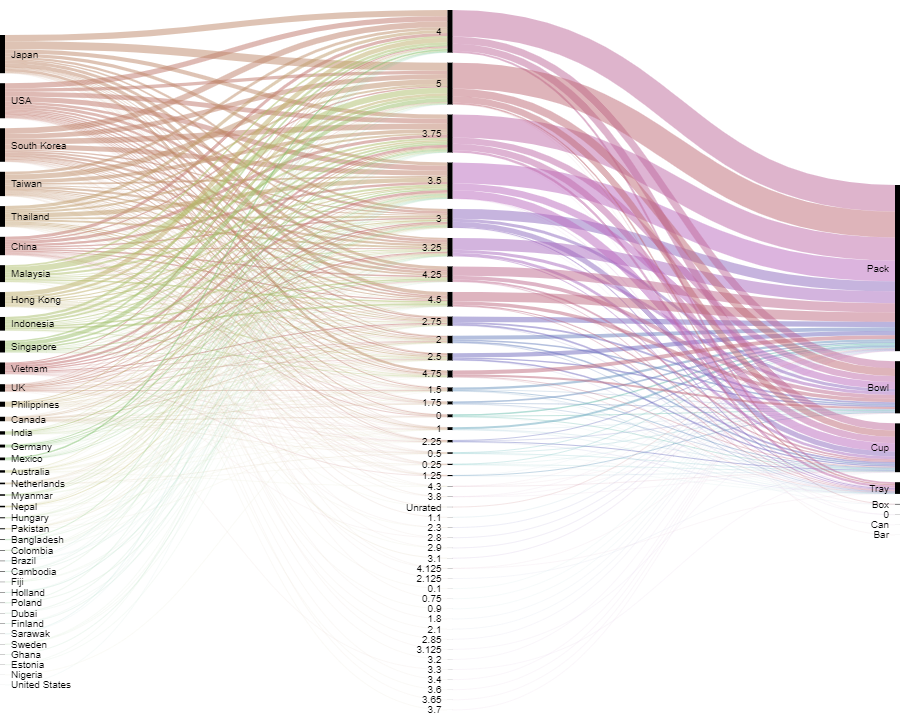

# 第四-五周作业          

<svg width="847" height="500" xmlns="http://www.w3.org/2000/svg"><g><path d="M84.54603150000005,432.57314787675347L84.5460315,500L134.7227835,500L134.7227835,443.3409997773923Z" style="fill: rgb(191, 221, 230); stroke: rgb(255, 255, 255);"></path><path d="M135.06493650000002,313.01381935989247L135.0649365,443.1919947243573L196.82357099999996,430.2767835253865L209.6286505,423.20011155521433L209.6286505,299.5229648301927Z" style="fill: rgb(180, 215, 217); stroke: rgb(255, 255, 255);"></path><path d="M111.19975749999999,188.3428949556452L111.19975749999999,311.9294350747834L135.06493650000002,313.01381935989247L209.6286505,299.5229648301927L301.5651885,194.01829501509178L309.9051705,180.24135224844485L309.9051705,177.48250344686568L298.34866494134815,172.97483603340433Z" style="fill: rgb(184, 217, 222); stroke: rgb(255, 255, 255);"></path><path d="M0,192.18274975358437L17.963038,187.26586244389014L17.963037999999997,52.90036293672137L0,42.820743879996016Z" style="fill: rgb(209, 231, 253); stroke: rgb(255, 255, 255);"></path><path d="M150.5473645,0L150.5473645,45.536739154501745L298.34866494134815,172.97483603340433L309.9051705,177.48250344686568L311.35932149999996,175.9172354583962L311.35932149999996,0Z" style="fill: rgb(165, 207, 199); stroke: rgb(255, 255, 255);"></path><path d="M45.198424999999986,440.41664480146903L45.198425,500L84.5460315,500L84.54603150000005,432.57314787675347L76.75349449999999,429.71067187169746Z" style="fill: rgb(194, 223, 235); stroke: rgb(255, 255, 255);"></path><path d="M76.75349450000002,318.8501131383033L76.75349449999999,429.71067187169746L84.54603150000005,432.57314787675347L134.7227835,443.3409997773923L135.0649365,443.1919947243573L135.06493650000002,313.01381935989247L111.19975749999999,311.9294350747834Z" style="fill: rgb(185, 218, 224); stroke: rgb(255, 255, 255);"></path><path d="M66.71985449999998,190.77792482750908L66.7198545,313.7760785136041L76.75349450000002,318.8501131383033L111.19975749999999,311.9294350747834L111.19975749999999,188.3428949556452L88.95980599999999,184.69035014784936Z" style="fill: rgb(190, 221, 230); stroke: rgb(255, 255, 255);"></path><path d="M88.95980599999999,64.92332304538137L88.95980599999999,184.69035014784936L111.19975749999999,188.3428949556452L298.34866494134815,172.97483603340433L150.5473645,45.536739154501745Z" style="fill: rgb(186, 218, 225); stroke: rgb(255, 255, 255);"></path><path d="M311.35932149999996,0L311.35932149999996,175.9172354583962L466.9005055689115,117.05713402434628L538.774280258272,0Z" style="fill: rgb(131, 188, 158); stroke: rgb(255, 255, 255);"></path><path d="M14.54150699999959,436.21224378354896L14.541507,500L45.198425,500L45.198424999999986,440.41664480146903L32.547314,438.67654085676963Z" style="fill: rgb(206, 229, 249); stroke: rgb(255, 255, 255);"></path><path d="M32.54731399999776,312.4888784741255L32.547314,438.67654085676963L45.198424999999986,440.41664480146903L76.75349449999999,429.71067187169746L76.75349450000002,318.8501131383033L66.7198545,313.7760785136041L35.926075499999996,312.5328085094563Z" style="fill: rgb(203, 227, 245); stroke: rgb(255, 255, 255);"></path><path d="M35.92607550000013,187.51170687438395L35.926075499999996,312.5328085094563L66.7198545,313.7760785136041L66.71985449999998,190.77792482750908L48.756817,187.33610380652598Z" style="fill: rgb(202, 227, 244); stroke: rgb(255, 255, 255);"></path><path d="M48.75681700000001,61.329312493173276L48.756817,187.33610380652598L66.71985449999998,190.77792482750908L88.95980599999999,184.69035014784936L88.95980599999999,64.92332304538137L73.562917,63.02680939517968Z" style="fill: rgb(197, 224, 238); stroke: rgb(255, 255, 255);"></path><path d="M73.562917,0L73.562917,63.02680939517968L88.95980599999999,64.92332304538137L150.5473645,45.536739154501745L150.5473645,0Z" style="fill: rgb(194, 223, 234); stroke: rgb(255, 255, 255);"></path><path d="M14.541507,500L14.54150699999959,436.21224378354896L0,434.0230581779454L0,500Z" style="fill: rgb(206, 230, 250); stroke: rgb(255, 255, 255);"></path><path d="M0,434.0230581779454L14.54150699999959,436.21224378354896L32.547314,438.67654085676963L32.54731399999776,312.4888784741255L0,312.04343202904386Z" style="fill: rgb(203, 227, 245); stroke: rgb(255, 255, 255);"></path><path d="M0,312.04343202904386L32.54731399999776,312.4888784741255L35.926075499999996,312.5328085094563L35.92607550000013,187.51170687438395L17.963038,187.26586244389014L0,192.18274975358437Z" style="fill: rgb(202, 227, 245); stroke: rgb(255, 255, 255);"></path><path d="M17.963037999999997,52.90036293672137L17.963038,187.26586244389014L35.92607550000013,187.51170687438395L48.756817,187.33610380652598L48.75681700000001,61.329312493173276Z" style="fill: rgb(202, 227, 244); stroke: rgb(255, 255, 255);"></path><path d="M0,42.820743879996016L17.963037999999997,52.90036293672137L48.75681700000001,61.329312493173276L73.562917,63.02680939517968L73.562917,0L0,0Z" style="fill: rgb(195, 223, 236); stroke: rgb(255, 255, 255);"></path><path d="M134.7227835,443.3409997773923L134.7227835,500L196.82357100000002,500L196.82357099999996,430.2767835253865L135.0649365,443.1919947243573Z" style="fill: rgb(175, 212, 211); stroke: rgb(255, 255, 255);"></path><path d="M209.6286505,299.5229648301927L209.6286505,423.20011155521433L301.5651885,461.26232077016573L301.5651885,194.01829501509178Z" style="fill: rgb(156, 202, 188); stroke: rgb(255, 255, 255);"></path><path d="M309.9051705,177.48250344686568L309.9051705,180.24135224844485L503.90597849999995,428.76050166558093L503.9059784999999,149.31873120707596L466.9005055689115,117.05713402434628L311.35932149999996,175.9172354583962Z" style="fill: rgb(112, 177, 137); stroke: rgb(255, 255, 255);"></path><path d="M466.9005055689115,117.05713402434628L503.9059784999999,149.31873120707596L633.4964654999999,240.1266151060477L633.4964654999999,39.78398080986945L589.4527619628753,0L538.774280258272,0Z" style="fill: rgb(88, 165, 112); stroke: rgb(255, 255, 255);"></path><path d="M589.4527619628753,0L633.4964654999999,39.78398080986945L781.04999,99.15539465255264L781.04999,0Z" style="fill: rgb(62, 153, 87); stroke: rgb(255, 255, 255);"></path><path d="M196.82357099999996,430.2767835253865L196.82357100000002,500L343.7475226973073,500L301.5651885,461.26232077016573L209.6286505,423.20011155521433Z" style="fill: rgb(166, 207, 200); stroke: rgb(255, 255, 255);"></path><path d="M301.5651885,194.01829501509178L301.5651885,461.26232077016573L343.7475226973073,500L552.9656907981713,500L503.90597849999995,428.76050166558093L309.9051705,180.24135224844485Z" style="fill: rgb(144, 195, 173); stroke: rgb(255, 255, 255);"></path><path d="M503.9059784999999,149.31873120707596L503.90597849999995,428.76050166558093L552.9656907981713,500L847,500L847,496.68136269659396L633.4964654999999,240.1266151060477Z" style="fill: rgb(107, 175, 132); stroke: rgb(255, 255, 255);"></path><path d="M633.4964654999999,39.78398080986945L633.4964654999999,240.1266151060477L847,496.68136269659396L847,195.28229634587478L781.04999,99.15539465255264Z" style="fill: rgb(74, 158, 98); stroke: rgb(255, 255, 255);"></path><path d="M781.04999,0L781.04999,99.15539465255264L847,195.28229634587478L847,0Z" style="fill: rgb(12, 138, 57); stroke: rgb(255, 255, 255);"></path><circle transform="translate(94.09210260553424, 500)" r="1.5" style="fill: rgb(0, 0, 0); pointer-events: none;"></circle><circle transform="translate(149.2129670773581, 375)" r="1.5" style="fill: rgb(0, 0, 0); pointer-events: none;"></circle><circle transform="translate(126.59664714199151, 250)" r="1.5" style="fill: rgb(0, 0, 0); pointer-events: none;"></circle><circle transform="translate(0, 125)" r="1.5" style="fill: rgb(0, 0, 0); pointer-events: none;"></circle><circle transform="translate(224.11028075136335, 0)" r="1.5" style="fill: rgb(0, 0, 0); pointer-events: none;"></circle><circle transform="translate(74.99995960412039, 500)" r="1.5" style="fill: rgb(0, 0, 0); pointer-events: none;"></circle><circle transform="translate(120.9169056756211, 375)" r="1.5" style="fill: rgb(0, 0, 0); pointer-events: none;"></circle><circle transform="translate(95.80286810745304, 250)" r="1.5" style="fill: rgb(0, 0, 0); pointer-events: none;"></circle><circle transform="translate(116.33205413047868, 125)" r="1.5" style="fill: rgb(0, 0, 0); pointer-events: none;"></circle><circle transform="translate(398.6083619470814, 0)" r="1.5" style="fill: rgb(0, 0, 0); pointer-events: none;"></circle><circle transform="translate(15.396889517269237, 500)" r="1.5" style="fill: rgb(0, 0, 0); pointer-events: none;"></circle><circle transform="translate(32.59008281155322, 375)" r="1.5" style="fill: rgb(0, 0, 0); pointer-events: none;"></circle><circle transform="translate(37.636841042213696, 250)" r="1.5" style="fill: rgb(0, 0, 0); pointer-events: none;"></circle><circle transform="translate(61.58755806907695, 125)" r="1.5" style="fill: rgb(0, 0, 0); pointer-events: none;"></circle><circle transform="translate(76.98444758634619, 0)" r="1.5" style="fill: rgb(0, 0, 0); pointer-events: none;"></circle><circle transform="translate(13.686124015350433, 500)" r="1.5" style="fill: rgb(0, 0, 0); pointer-events: none;"></circle><circle transform="translate(32.50454453645728, 375)" r="1.5" style="fill: rgb(0, 0, 0); pointer-events: none;"></circle><circle transform="translate(34.21531003837608, 250)" r="1.5" style="fill: rgb(0, 0, 0); pointer-events: none;"></circle><circle transform="translate(35.92607554029489, 125)" r="1.5" style="fill: rgb(0, 0, 0); pointer-events: none;"></circle><circle transform="translate(70.14138557867098, 0)" r="1.5" style="fill: rgb(0, 0, 0); pointer-events: none;"></circle><circle transform="translate(175.35346394667744, 500)" r="1.5" style="fill: rgb(0, 0, 0); pointer-events: none;"></circle><circle transform="translate(270.04433447788324, 375)" r="1.5" style="fill: rgb(0, 0, 0); pointer-events: none;"></circle><circle transform="translate(493.21369420319127, 250)" r="1.5" style="fill: rgb(0, 0, 0); pointer-events: none;"></circle><circle transform="translate(602.1894566754191, 125)" r="1.5" style="fill: rgb(0, 0, 0); pointer-events: none;"></circle><circle transform="translate(715.0999798020601, 0)" r="1.5" style="fill: rgb(0, 0, 0); pointer-events: none;"></circle><circle transform="translate(218.2936780448394, 500)" r="1.5" style="fill: rgb(0, 0, 0); pointer-events: none;"></circle><circle transform="translate(333.08604322359116, 375)" r="1.5" style="fill: rgb(0, 0, 0); pointer-events: none;"></circle><circle transform="translate(514.5982629771763, 250)" r="1.5" style="fill: rgb(0, 0, 0); pointer-events: none;"></circle><circle transform="translate(664.8034740456474, 125)" r="1.5" style="fill: rgb(0, 0, 0); pointer-events: none;"></circle><circle transform="translate(847, 0)" r="1.5" style="fill: rgb(0, 0, 0); pointer-events: none;"></circle></g></svg>

# 第三周作业

展开

    
## 调研目前免费的可视化图表工具      
1.[Tableau Public](https://www.tableau.com)       
2.[Qlik Sense Desktop](https://www.qlik.com/us)           
>均提供软件中文版、中文官网、全面的中文在线帮助，有线上教学视频、学习交流社区           
可以在没有任何或少量IT技术能力的情况下，使用拖拉拽的方式对模型进行自动化的修改，轻松创建交互式报表，用可视化的方式例如各种图形来展示分析结果。            
免费版，适合轻量数据分析，日常业务数据梳理，虽然免费版功能有限，但可处理数据量还是比EXCEL多，EXCEL数据量过多打开都困难的文件，可以在工具中轻松打开，拖拉拽实现交互式报表分析。            
更多专业功能可以循序渐进的学习使用，并适时引入技术手段做高阶应用分析。

3.[Flourish](https://flourish.studio/)        
4.[Rawgraphs](https://rawgraphs.io/)          
5.[BDP](https://me.bdp.cn/home.html)        
6.[图表秀](https://www.tubiaoxiu.com/)        
7.[大数据魔镜](http://www.moojnn.com/product-center/freeinto.html)         
8.[百度·图说](http://tushuo.baidu.com/)         
9.[Echarts](https://www.echartsjs.com/zh/builder.html)      
10.[HTML5 Word Cloud](https://timdream.org/wordcloud/)       
11.[Tagxedo](http://www.tagxedo.com/)(关键词分析/词云制作)        
12.[图悅](http://www.picdata.cn/index.php)        
13.[群绘](http://www.iqunhui.com)(微信社群分析产品，重新描绘社群画像)       
14.[Google Chart](https://developers.google.com/chart)          
## 用图表工具呈现选取的数据集
### 所选数据集          
* [Kaggle:对全球超过2500种拉面的评级](https://www.kaggle.com/residentmario/ramen-ratings)        
* [数据源网站](https://www.theramenrater.com/)        
      
### 使用的工具及呈现及使用体会         
#### Flourish        
* [用Flourish呈现的页面](https://public.flourish.studio/visualisation/776267/)          
        
1.对新手友好，选择哪种可视化模板，在页面上有对应教程（有案例的那种），有些还有视频展示操作过程。       
2.页面简洁好懂，上端有两个显示按钮，一个是所选数据，一个是预览，看得比较清楚。        
3.操作方便，改变数据坐标、或者改变哪类数据用的配色（整体或个别）都不难。       
4.最终呈现的页面视觉表现力较好，也能交互，还能导出为链接和脚本的格式。（就是不知道怎么把脚本嵌入进markdown，插了好久都没查到…）       
5.地图比较少，只有几个国家的，全球好像不行。（想要导入地名或国家名的数据直接生成就做不到）
#### Rawgraph       
       
1.可选择的可视化方式没有flourish多但也足够，不过每种下面都有解释该模板适合呈现什么样的数据，比较科学。（比如分布、层次结构、时间序列这些）          
2.操作过程是线性的，很顺畅，先导入或复制数据，页面在线判断符合格式之后选择模板，再进行各个轴的数据选择呈现。        
3.非常简洁易懂，用拖动的方式呈现（顺序一致），实时生成，还会提示（黄色和绿色）这组数据能不能用这个维度呈现。         
4.配色会有重复的现象，一般需要自己调整，搭配的种类不够多。       
5.默认排序是按照数量，但是比如我想调整成评分从高到低，没找到在哪调整。
#### Tableau       
        
1.下载的能免费用14天，我用的是online所以只能下载图片       
2.最好的一点体验就是，导入关于地理位置的文本数据就能在世界地图上呈现！（虽然我选的数据没涉及大部分国家，但是这样看真的很直观）      
3.中文教程很方便，也很详细，对着学就是了。（对于我这种想做什么都描述不清楚的比较适合）        
4.每类数据呈现的时候，左边有个标记可以选择用颜色还是大小还是标签工具等，方便修改。        
5.就最后的成果来看，我选的维度有点多了，因为既有颜色代表类别，又有深浅代表评分，所以乍一看不太明白（而且也没有图例，像详细信息要在交互时才能出现）。本来想的是用一种颜色呈现一种类别，一张图上只有深浅体现评分，然后有个图例，选择不同类别的时候对应地图的主色是不一样的（还在琢磨怎么做到，需要再学习）

# 第二周作业

展开

    
## 我国还有哪些关于公共数据开放的条例或法规？     
1.《上海市公共数据开放暂行办法》        
[上海市公共数据开放暂行办法](http://www.shanghai.gov.cn/nw2/nw2314/nw2319/nw12344/u26aw62638.html)         
2.《中华人民共和国网络安全法》        
[中华人民共和国网络安全法](http://www.cac.gov.cn/2016-11/07/c_1119867116.htm)    
> 第十八条 国家鼓励开发网络数据安全保护和利用技术，促进公共数据资源开放，推动技术创新和经济社会发展。国家支持创新网络安全管理方式，运用网络新技术，提升网络安全保护水平。
    
3.《公共资源交易平台管理暂行办法》       
[公共资源交易平台管理暂行办法](http://www.ndrc.gov.cn/zcfb/zcfbl/201606/W020160630390343326928.pdf)       
> 第九条 公共资源交易平台应当按照国家统一的技术标准和数据规范，建立公共资源交易电子服务系统，开放对接各类主体依法建设的公共资源电子交易系统和政府有关部门的电子监管系统。

4.《南京市政务数据管理暂行办法》（2019年9月20日起实行）      
[南京市政务数据管理暂行办法](http://www.nanjing.gov.cn/zdgk/201908/t20190827_1636111.html)       
5.《促进大数据发展行动纲要》        
[促进大数据发展行动纲要](http://www.gov.cn/zhengce/content/2015-09/05/content_10137.htm)        
## 国内外有哪些政府开放数据平台？        
1.[联合国官方地图库](https://www.un.org/Depts/Cartographic/english/htmain.htm)           
2.[世界银行](https://data.worldbank.org/)      
3.[联合国数据库](http://data.un.org/)       
4.[联合国统计](https://unstats.un.org/unsd/mbs/app/DataSearchTable.aspx)         
5.[美国政府开放数据](https://www.data.gov/)         
6.[美国国家环境信息中心](https://www.ncdc.noaa.gov/)      
7.[纽约政府开放数据平台](https://opendata.cityofnewyork.us/)       
8.[休斯顿市政府开放数据平台](http://data.houstontx.gov/)    
9.[新加坡政府开放数据平台](https://data.gov.sg/)         
10.[经济合作与发展组织OECD](http://www.oecd.org/)          
> 经济合作与发展组织的成员包括：奥地利、澳大利亚、比利时、加拿大、捷克共和国、丹麦、芬兰、法国、德国、希腊、匈牙利、冰岛、意大利、日本、卢森堡、墨西哥、荷兰、新西兰、挪威、波兰、葡萄牙、韩国、西班牙、瑞典、瑞士、土耳其、英国和美国。

11.[国家统计局](http://www.stats.gov.cn/)       
12.[中华人民共和国中央人民政府](http://www.gov.cn/shuju/index.htm)        
13.[中国国家调查数据库](http://www.cnsda.org/index.php)        
14.[中国科学院地理科学与资源研究所](http://www.data.ac.cn/)       
15.[中国国土资源与经济社会发展统计数据库](http://tongji.cnki.net/kns55/addvalue/indexlist.aspx?sicode=Z006)         
16.[中国政府开放数据平台汇总](http://www.tanmer.com/blog/451)           
17.[各国统计网站汇总](http://data.stats.gov.cn/gjwz.htm)
## 2012-2018年各季度GDP增速        
### 选取的统计指标         
1.国内生产总值(不变价)当季值(亿元)          
国内生产总值(GDP)是指按市场价格计算的一个国家（或地区）所有常住单位在一定时期内生产活动的最终成果。国内生产总值有三种表现形态，即价值形态、收入形态和产品形态。从价值形态看，它是所有常住单位在一定时期内生产的全部货物和服务价值与同期投入的全部非固定资产货物和服务价值的差额，即所有常住单位的增加值之和；从收入形态看，它是所有常住单位在一定时期内创造并分配给常住单位和非常住单位的初次收入之和；从产品形态看，它是所有常住单位在一定时期内最终使用的货物和服务价值与货物和服务净出口价值之和。在实际核算中，国内生产总值有三种计算方法，即生产法、收入法和支出法。三种方法分别从不同的方面反映国内生产总值及其构成。        
扣除价格变动因素后的价格称为不变价格。不变价是以某年份现价作为基期扣除价格变动因素，多用于计算与某指定年份相比的增长速度。计算GDP增速时选取扣除价格因素的不变价。不变价数据按不同基期分段计算。其中，2011-2015年数据按2010年价格计算，2016年及以后各季度数据按2015年价格计算。         
2.居民消费价格指数(1978=100)        
居民消费价格指数是反映一定时期内居民所消费商品及服务项目的价格水平变动趋势和变动程度。取自统计局居民消费价格指数调查表。
### 数据页面      
       
         

### 计算步骤      
* GDP增速（同比）=（本季度国内生产总值（不变价）/去年同季度国内生产总值（不变价）-1）×100%     
* 因为2011-2015年的数据按2010年不变价计算，2016年以后各季度按2015年价格计算，按这个方法求得2016年各季度的GDP增速会异常高（超过20%）。
    * 方法一：考虑2010年到2015年之间的通货膨胀，2016年各季度的GDP增速应该为上式减去2010和2015间居民价格消费指数（CPI）的增长率。          
    2010年居民价格消费指数为536.1（1978年=100），2015年居民价格消费指数为615.2（1978年=100），两年之间的增长率为14.75%       
    * 方法二：选取2015年各季度GDP（现价）和2016年各季度GDP（不变价）来计算2016年GDP增速。        
    * 两个方法的计算结果存在差异
### 答案       
<table>
   <tr><td>  季度  </td><td>  国内生产总值(不变价)当季值(亿元)  </td><td>  国内生产总值(不变价)增速  </td></tr>
   <tr><td>2018年第四季度</td><td>232264.9</td><td>  6.35%</td></tr>
   <tr><td>2018年第三季度</td><td>213043.8</td><td>  6.45%</td></tr>
   <tr><td>2018年第二季度</td><td>204077.2</td><td>  6.69%</td></tr>
   <tr><td>2018年第一季度</td><td>183613</td><td>  6.84%</td></tr>
   <tr><td>2017年第四季度</td><td>218393.3</td><td>  6.66%</td></tr>
   <tr><td>2017年第三季度</td><td>200133.4</td><td>  6.74%</td></tr>
   <tr><td>2017年第二季度</td><td>191284.6</td><td>  6.81%</td></tr>
   <tr><td>2017年第一季度</td><td>171852.5</td><td>  6.85%</td></tr>
   <tr><td>2016年第四季度</td><td>204764.2</td><td>  6.06%(方法一)6.80%（方法二）</td></tr>
   <tr><td>2016年第三季度</td><td>187498.6</td><td>  7.70%（方法一）6.65%（方法二）</td></tr>
   <tr><td>2016年第二季度</td><td>179089.5</td><td>  7.16%（方法一）6.68%（方法二）</td></tr>
   <tr><td>2016年第一季度</td><td>160837.9</td><td>  6.64%（方法一）6.80%(方法二)</td></tr>
   <tr><td>2015年第四季度</td><td>169488.4</td><td>  6.82%</td></tr>
   <tr><td>2015年第三季度</td><td>153127.4</td><td>  6.86%</td></tr>
   <tr><td>2015年第二季度</td><td>146898.4</td><td>  6.99%</td></tr>
   <tr><td>2015年第一季度</td><td>132491.5</td><td>  6.98%</td></tr>
   <tr><td>2014年第四季度</td><td>158668.8</td><td>  7.23%</td></tr>
   <tr><td>2014年第三季度</td><td>143294.9</td><td>  7.14%</td></tr>
   <tr><td>2014年第二季度</td><td>137305</td><td>  7.48%</td></tr>
   <tr><td>2014年第一季度</td><td>123850.1</td><td>  7.38%</td></tr>
   <tr><td>2013年第四季度</td><td>147965.2</td><td>  7.71%</td></tr>
   <tr><td>2013年第三季度</td><td>133751.6</td><td>  7.94%</td></tr>
   <tr><td>2013年第二季度</td><td>127743.9</td><td>  7.57%</td></tr>
   <tr><td>2013年第一季度</td><td>115342.5</td><td>  7.86%</td></tr>
   <tr><td>2012年第四季度</td><td>137370.4</td><td>  8.13%</td></tr>
   <tr><td>2012年第三季度</td><td>123917</td><td>  7.54%</td></tr>
   <tr><td>2012年第二季度</td><td>118757.4</td><td>  7.65%</td></tr>
   <tr><td>2012年第一季度</td><td>106938.5</td><td>  8.12%</td></tr>
</table>

# 第一周作业

展开

## 个人数据的数据集（原始数据）         
 
## 数据的呈现

## 操作过程和感想        
  1.统计使用时间和解锁次数的功能是手机自带的，但是截完图发现只有每个时段解锁次数的比例，不知道到底解锁了几次。所以就根据比例和总次数，手动计算到底每个小时解锁了几次手机。             
  2.这个功能并不能回看前一天的具体记录，所以每天要在23：59之前完成截图。然后因为立志早睡，所以得在晚上睡前完成截图，当天不再使用手机。       
  3.本来没想涂色的，因为颜色深浅和线条多少的含义是一样的。具体画的时候先画了第一天，觉得线条有点乱。。然后只完成涂色看了下情况，发现看得比较顺眼但是并不能体现具体的次数变化，就像一个颜色对应5次数，会有一定的误差，而用线条就更直观一些。           
  4.发现自己没有早课就起不来是真的，说着坚持早睡其实越睡越晚也是真的。         
  5.关注了一下异常值。最多一个小时解锁了30次手机，画了两次线条才画出来，是周三傍晚。那个时候……我得知自己几个小时前错过了胡歌，非常懊恼orz       
  6.其实手机作为离不开的一个物品，从使用习惯中确实可以看出一些生活方式。包括每天比较固定的一些时间是使用手机的高峰期，那么从传播角度来说，如果需要发布一些希望扩散的信息，可以选择这些时段发布。对于个人而言，错过的“重要消息”往往发生在一些日常不会使用手机的时刻（比如错过胡歌），对我今后根据目的调整手机使用习惯有一定的启发。           
  7.想过很多呈现的形式，限定图形和线条是一开始最初的想法，因为随着解锁次数的增多，使用频次的密集会把一整块时间分成很多小块，就和符合当下碎片化生活的现状。一开始想的是用方格，后来发现一些奇数有点难画。至于为什么最后是长方形……因为选的纸的范围，还有5天×24小时这个坐标轴的限定。          
  8.用荧光笔和马克笔可能涂得快一些，但是会渗进纸里，彩铅比较有手绘的感觉。        
## 你认为日常生活中哪些数据是被搜集的？被谁搜集了？          
* 行为数据（包括动态和静态）    
  * 走路的步数、所在的地点、消费记录等
  * 传输的数据（聊天记录、短信记录、通话记录、微博内容等）
* 个人的基本数据         
  * 可测得的人体相关数据（身高、体重、面部特征、血糖、脉搏等）    
  * 与个人绑定的相关数据（身份证号、手机号、微信号、一些网站的账号等）
* 搜集方       
  * 个人所在（或者曾经所在）的单位组织。比如学校、工作单位等。       
  * 给个人提供（过）服务的机构。银行、医院、移动公司、淘宝应用等。       
  * 与个人接触过的任何一方（不管是人还是机构）都可能收集个人数据，因为有接触就有数据产生。

